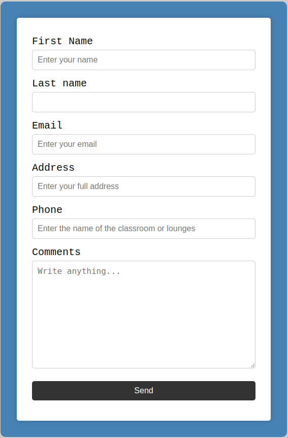

# Django-Contact-Form
***Django*** is a high-level Python Web framework that encourages rapid development and clean, pragmatic design. It takes care of much of the hassle of Web development, so you can focus on writing your app without needing to reinvent the wheel. It’s free and open source.

## Table of Contents

<ol>
    <li><a href="#description">Description</a></li>
    <li><a href="#usage">How use the project</a></li>
    <li><a href="##screenshot">Screenshot</a></li>
    <li><a href="#contributions">Contributions</a></li>
  </ol>

## Description

Django Contact Form is a web application that allows you to send messages to the site administrator. The application is written in Python using the Django framework and designed to be used as a contact form on a website. 

## How use the project

1. Clone the repository
    > ``git clone`` https://github.com/Alibakhshov/Django-Contact-Form.git
2. Open the project folder in your desired IDE
3. Navigate to the root folder of the project (there is a file named `manage.py` in the root folder)
    > ``cd contactform ``

    > ``pip install -r requirements.txt``

    > ``python manage.py runserverd``
4. Open the link in your browser
    > http://127.0.0.1:8000/
5. Use the application
6. To stop the server, press `Ctrl + C` in the terminal
## Screenshot

## Contributions

Anyone can contribute to this repository. If you want to contribute, please follow the steps below:

1. Fork this repository
2. Clone the forked repository
3. Create a new branch
4. Make changes to the code
5. Commit the changes
6. Push the changes to the forked repository
7. Create a pull request
8. Wait for the pull request to be merged
9. Repeat steps 1-8

<a href="#top">back to top</a>

